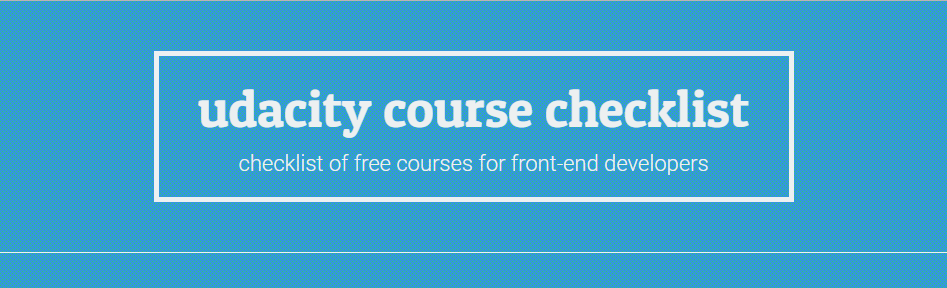

A awesome checklist of free Udacity courses for front-end developers. Just fork this repo and start to study. After each course finished, return here and check respective course to monitoring your progress! :)

## Padawan

- [x] [Intro to HTML and CSS](https://br.udacity.com/course/intro-to-html-and-css--ud304)
- [x] [Javascript Basics](https://br.udacity.com/course/javascript-basics--ud804)
- [ ] [HTML5 Canvas](https://br.udacity.com/course/html5-canvas--ud292)
- [x] [Writing READMEs](https://br.udacity.com/course/writing-readmes--ud777)
- [ ] [How to use Git and Github](https://br.udacity.com/course/how-to-use-git-and-github--ud775/)
- [ ] [Intro to Computer Science](https://br.udacity.com/course/intro-to-computer-science--cs101)

## Jedi Knight

- [x] [Intro to jQuery](https://br.udacity.com/course/intro-to-jquery--ud245)
- [x] [Intro to AJAX](https://br.udacity.com/course/intro-to-ajax--ud110)
- [ ] [Javascript Testing](https://br.udacity.com/course/javascript-testing--ud549)
- [x] [Object Oriented Javascript](https://br.udacity.com/course/object-oriented-javascript--ud015)
- [ ] [Responsive Web Design Fundamentals](https://br.udacity.com/course/responsive-web-design-fundamentals--ud893)
- [ ] [Responsive Images](https://br.udacity.com/course/responsive-images--ud882)
- [ ] [Building High Conversion Web Forms](https://br.udacity.com/course/building-high-conversion-web-forms--ud890/)
- [ ] [HTML5 Game Development](https://br.udacity.com/course/html5-game-development--cs255/)
- [ ] [Mobile Web Development](https://br.udacity.com/course/mobile-web-development--cs256/)
- [ ] [Offline Web Applications](https://br.udacity.com/course/offline-web-applications--ud899)
- [ ] [Intro to Progressive Web Apps](https://br.udacity.com/course/intro-to-progressive-web-apps--ud811)
- [ ] [Web Performance Optimization](https://br.udacity.com/course/website-performance-optimization--ud884)
- [ ] [Web Tooling & Automation](https://br.udacity.com/course/web-tooling-automation--ud892)
- [ ] [Google Maps APIs](https://br.udacity.com/course/google-maps-apis--ud864)
- [ ] [Technical Interview](https://br.udacity.com/course/technical-interview--ud513)
- [ ] [Product Design](https://br.udacity.com/course/product-design--ud509/)

## Jedi Master

- [x] [JavaScript Design Patterns](https://br.udacity.com/course/javascript-design-patterns--ud989)
- [ ] [Javascript Promises](https://br.udacity.com/course/javascript-promises--ud898)
- [ ] [Learn Backbone.js](https://br.udacity.com/course/learn-backbonejs--ud990)
- [ ] [Front End Frameworks](https://br.udacity.com/course/front-end-frameworks--ud894)
- [ ] [Browser Rendering Optimization](https://br.udacity.com/course/browser-rendering-optimization--ud860)
- [ ] [Intro to DevOps](https://br.udacity.com/course/intro-to-devops--ud611/)
- [ ] [Client-Server Communication](https://br.udacity.com/course/client-server-communication--ud897)
- [ ] [Web Accessibility](https://br.udacity.com/course/web-accessibility--ud891)